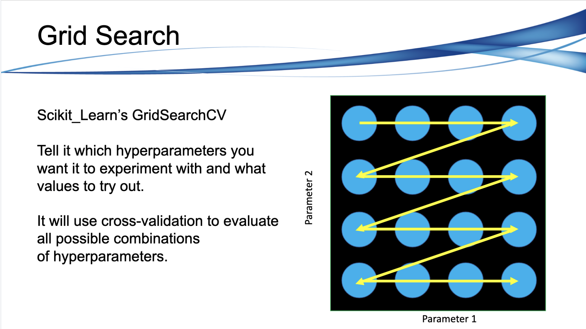
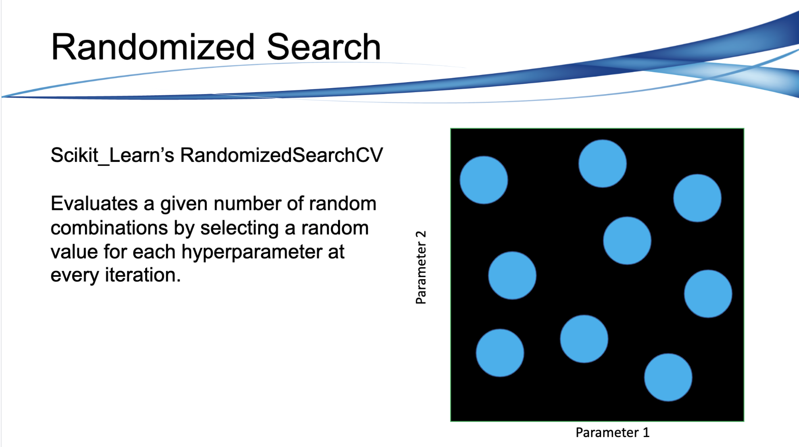
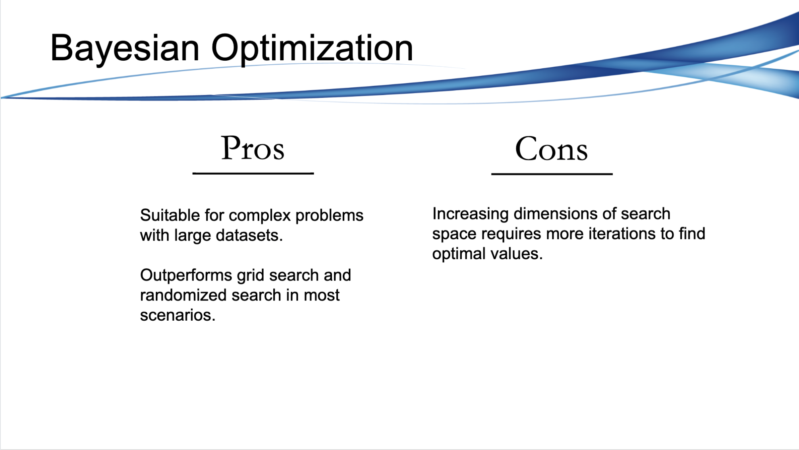
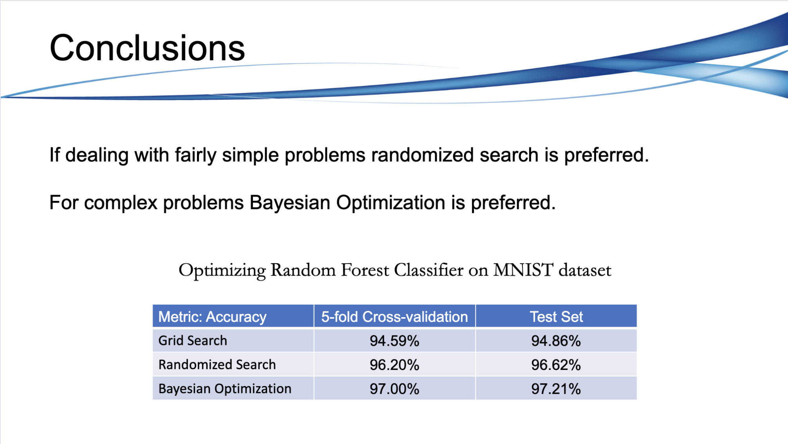

# Hyperparameter Optimization

Hyperparemter optimization is often one of the final steps in a data science project. Once you have a shortlist of promising models you will want to fine-tune them so that they perform better on your particular dataset.

In this repository we will go over three techniques used to find optimal hyperparameters with examples on how to implement them on models in Scikit-Learn and then finally a neural network in Keras. The three techniques we will discuss are as follows:

* Grid Search
* Randomized Search
* Bayesian Optimization

You can view the jupyter notebook [here](https://github.com/lukenew2/hyper_parameter_optimization/blob/master/hyper_parameter_optimization.ipynb)

# Grid Search

One option would be to fiddle around with the hyperparameters manually, until you find a great combination of hyperparameter values that optimize your performance metric. This would be very tedious work, and you may not have time to explore many combinations.

# Randomized Search

The grid search approach is fine when you are exploring relatively few combinations, like in the previous example, but when the hyperparameter space is large, it is often preferable to use `RandomizedSearchCV` instead. This class can be used in much the same way as the `GridSearchCV` class, but instead of trying out all possible combinations, it evaluates a given number of random combinations by selecting a random value for each hyperparameter at every iteration. This approach has two main benefits:

* If you let randomized search run for, say, 1,000 iterations, this approach will explore 1,000 different values for each hyperparameter (instead of just a few values per hyperparameter with the grid search approach).
* Simply by setting the number of iterations, you have more control over the computing budget you want to allocate to hyperparameter search.

# Bayesian Optimization

When training is slow, (e.g., for more complex problems with larger datasets), randomized search will only explore a tiny portion of the hyperparameter space. You can partially alleviate this problem by assisting the search process manually: first run a quick random search using wide ranges of hyperparameter values, then run another search using smaller ranges of values centered on the best ones found during the first run, and so on. This approach will hopefully zoom in on a good set of hyperparameters. However, it's very time consuming, and probably not the best use of your time.

Fortunately, there are many techniques to explore a search space much more efficiently than randomly. Their core idea is simple: when a region of the space turns out to be good, it should be explored more. Such techniques take care of the "zooming" process for you and lead to much better solutions in much less time.

One such technique is called Bayesian Optimization and we will use Scikit-Optimize (Skopt) https://scikit-optimize.github.io/ to perform Bayesian Optimization. Skopt is a general-purpose optimization library that performs Bayesian Optimization with its class `BayesSearchCV` using an interface similar to `GridSearchCV`.

# Conclusion

